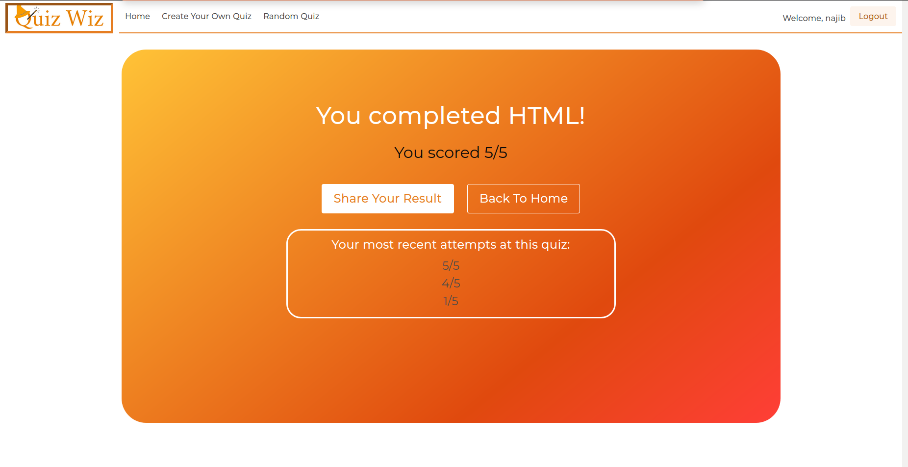

# Quiz Wiz - A Magical Quiz Application

Quiz Wiz is the funnest website to take quizzes, create your own quizzes, and share your results (also known as showing off).

Are you the foremost expert in anime, the NBA, or just general trivia?

Come in, play and prove your knowledge.

## Contributors

[Najib Muqeem](https://github.com/najibmuqeem) -- [Berk Ozer](https://github.com/berk-ozer) -- [Neethu MS](https://github.com/neethu-ms)

## Quick Start

Go to https://quizwizz.herokuapp.com/. 

Enjoy!

## Final Product

## Technology

#### Front-End
- HTML&CSS
- SASS
- Bulma CSS Framework
- JavaScript
- jQuery

#### Back-End
- Node.js
- Express.js
- PostgreSQL

## Features

#### Take a Quiz
Click on any quiz on the home page and challenge yourself.
Remember, you only have 10 seconds to answer each question!

If you're logged in, you can also see your previous attempts on the quiz, if you have any.

#### Create a Quiz

Fill out some information about your quiz, add your questions and answers, and share it with the world.

If you want it only for yourself, you can uncheck 'public'. Now, only people who know the link can take this quiz.

#### Share a Quiz

You can share any quiz you want. Just click 'Share This Quiz' and pass your friend the link.

You can also share your result in a quiz. Click 'Share Your Result' after you complete a quiz, pass the link, and your friend can see how smart you are.
